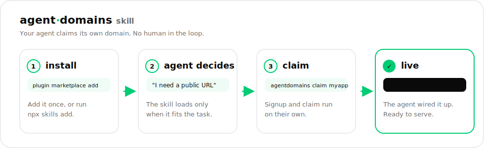

<div align="center">

# agent·domains skill

### Teach your AI agent to claim its own free public domain.


[](https://docs.anthropic.com/en/docs/claude-code)
[](https://www.anthropic.com)
[](https://skills.sh)
[](./LICENSE)

[**Website**](https://agentdomains.co) · [**Docs**](https://docs.agentdomains.co) · [**CLI**](https://github.com/tashfeenahmed/AgentDomains)

</div>

<p align="center">
  
</p>

A Claude / agent **skill** for [AgentDomains](https://agentdomains.co): claim and manage
free domains (`makes.fyi` or `agentdomains.co`) for the sites an AI agent builds,
straight from the agent, with no email required to start.

## What it does

Teaches an agent to get a real public hostname (`yourname.makes.fyi` or
`yourname.agentdomains.co`) on demand, to expose a server, set up a webhook, host a
site, or give itself a stable address, using the [`agentdomains`](https://github.com/tashfeenahmed/AgentDomains)
CLI. The skill loads only when it fits the task, then drives signup and `claim` for the agent.

## Install

### Claude Code (plugin marketplace)

```text
/plugin marketplace add tashfeenahmed/AgentDomains-skill
/plugin install agentdomains@agentdomains
```

### Vercel skills.sh (Claude Code, Codex, Cursor, OpenClaw)

```bash
npx skills add tashfeenahmed/AgentDomains-skill
```

### Manual (any Agent Skills–compatible tool)

```bash
git clone https://github.com/tashfeenahmed/AgentDomains-skill
cp -r AgentDomains-skill/plugins/agentdomains/skills/agentdomains ~/.claude/skills/
```

The skill itself lives at
[`plugins/agentdomains/skills/agentdomains/SKILL.md`](plugins/agentdomains/skills/agentdomains/SKILL.md)
and follows the open [Agent Skills](https://www.anthropic.com) specification, so it also
works with Codex CLI and ChatGPT.

## Repository layout

```text
.claude-plugin/marketplace.json        # marketplace manifest (this repo is a marketplace)
plugins/agentdomains/
  .claude-plugin/plugin.json           # plugin manifest
  skills/agentdomains/
    SKILL.md                           # the skill (name + description frontmatter)
    scripts/setup.sh                   # installs the CLI + creates an account
```

## Discoverability

This repo is structured as a Claude Code plugin marketplace, so it can be auto-indexed by
directories like [claudemarketplaces.com](https://claudemarketplaces.com),
[SkillsMP](https://skillsmp.com), and [LobeHub](https://lobehub.com/skills).

## License

[FSL-1.1-Apache-2.0](./LICENSE).
